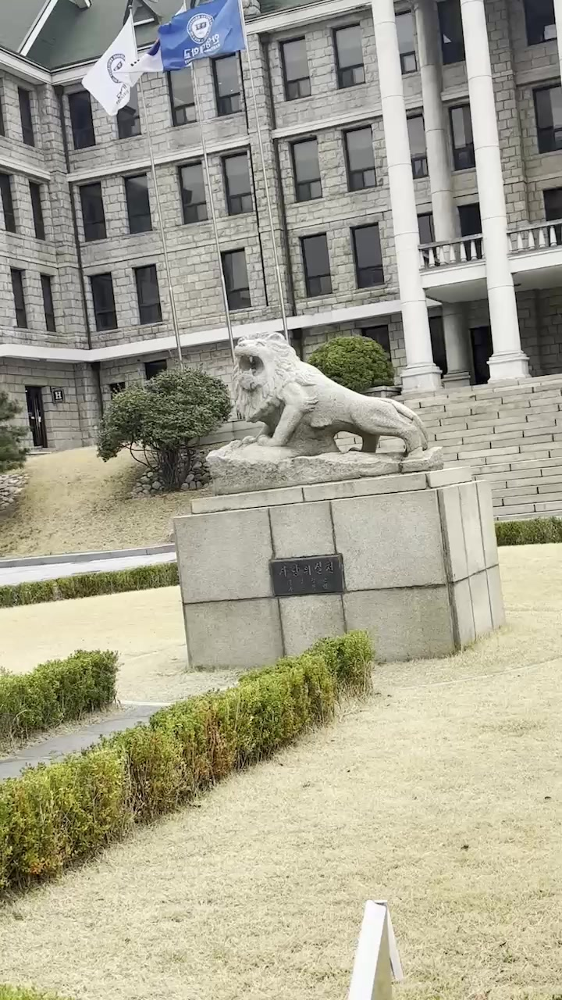
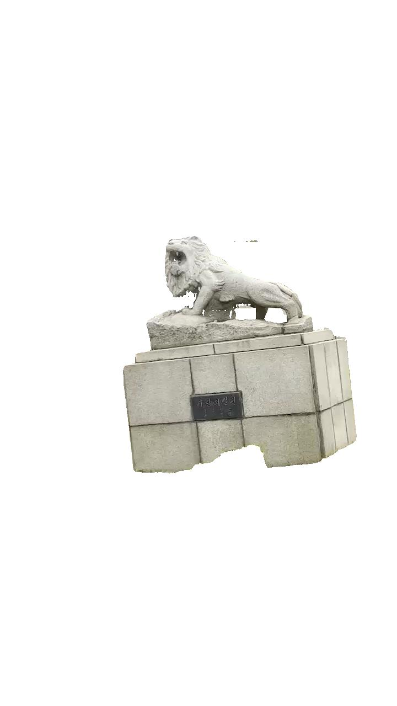
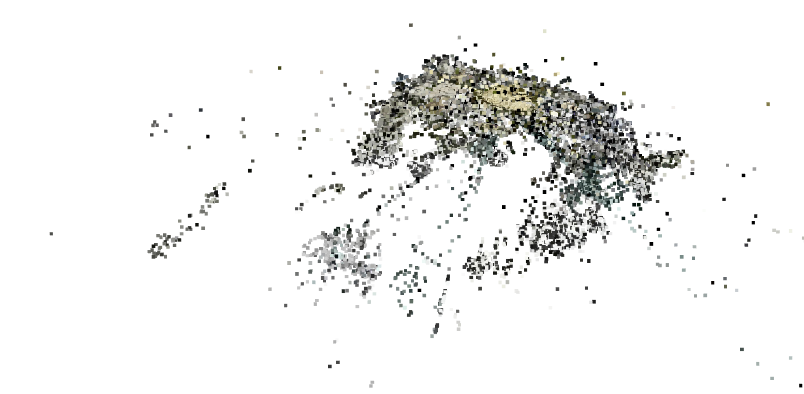
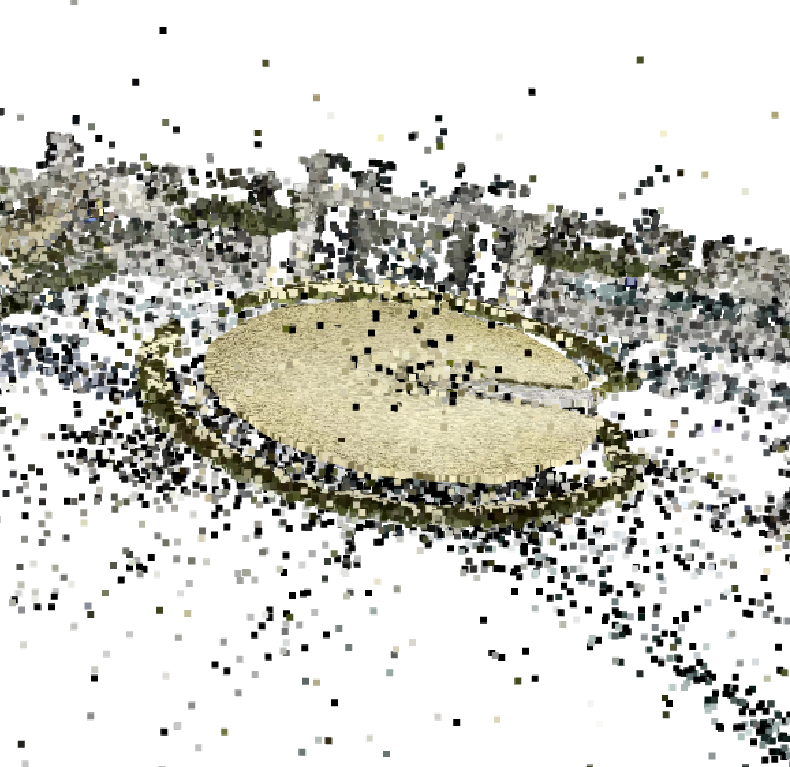
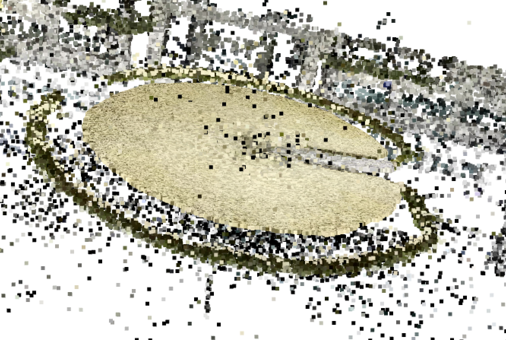
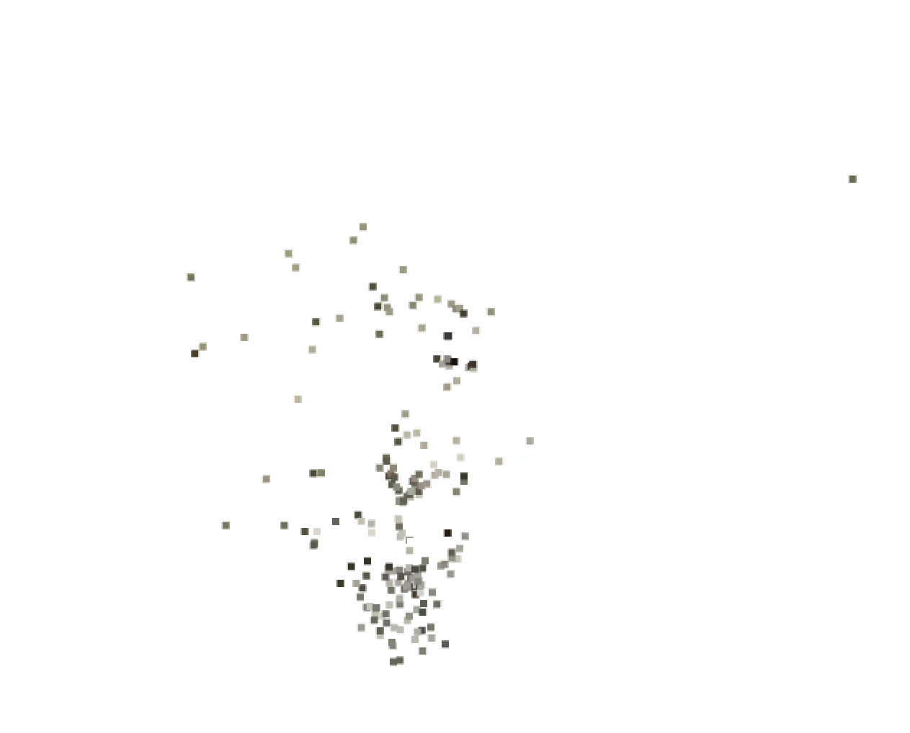
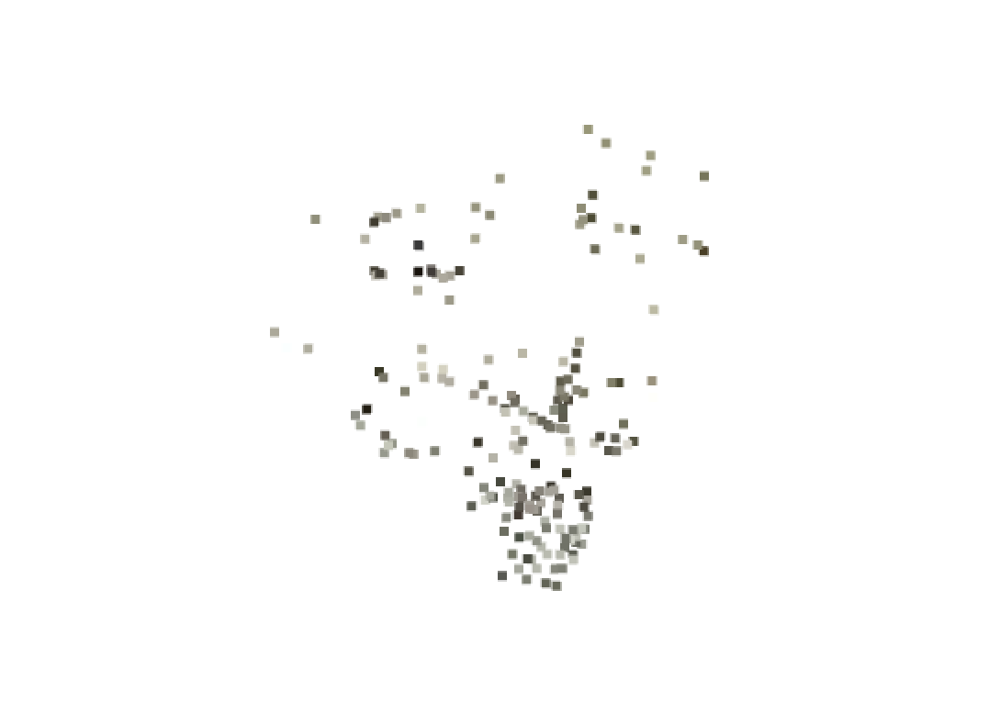

# Structure from motion with segmented imgaes

## 1. Introduction

This project presents a Structure-from-Motion (SfM) pipeline that integrates object-aware segmentation using SAM2 (Segment Anything Model 2)([paper link](https://arxiv.org/abs/2408.00714)).  
Using SAM2, segmentation is performed on specific objects of interest, allowing the 3D reconstruction process to focus selectively on these segmented regions instead of the entire scene.

COLMAP ([paper link](https://www.cv-foundation.org/openaccess/content_cvpr_2016/html/Schonberger_Structure-From-Motion_Revisited_CVPR_2016_paper.html)) serves as the SfM backbone to handle feature extraction, matching, triangulation, and camera pose estimation.  
By supplying COLMAP with object-segmented images from SAM2, the pipeline aims to minimize background noise and enhance the reconstruction quality of targeted objects.

This approach is particularly useful in scenarios where accurate 3D modeling of individual objects is more important than reconstructing full environments.


## 2. Environment

This project is developed using Python 3.10 with PyTorch 2.1.0 and torchvision 0.16.0.  
The core segmentation module is based on [SAM2](https://github.com/facebookresearch/sam2), which requires the following:

- Python ≥ 3.8  
- torch ≥ 2.0.0  
- torchvision ≥ 0.15.0  
- opencv-python  
- matplotlib  
- scikit-image  

I highly recommend using a virtual environment to manage dependencies cleanly and avoid conflicts.   
This project was developed on **WSL (Windows Subsystem for Linux)** using a virtual environment, which provided a clean and reproducible setup.

To create and activate a virtual environment on WSL:

```bash
python3 -m venv sam2_env
source sam2_env/bin/activate
```

For the Structure-from-Motion component, COLMAP is used.   
COLMAP was installed via the system package manager on WSL as follows:   

```bash
sudo apt update
sudo apt install colmap
```

## 3. Workflow

### 1. Capture a video of the target object   
Begin by recording a video that thoroughly captures the object of interest from all angles — ideally covering 360 degrees, including top and bottom views if possible.   
Instead of using the original Segment Anything Model (SAM), this project employs SAM2, which introduces a novel memory bank mechanism.   
This allows for consistent and context-aware segmentation across video frames, making it well-suited for video-based applications.   

### 2. Segment the video using SAM2   
The recorded video is segmented frame-by-frame using SAM2.
To do this:

- The video is first split into individual frames using `ffmpeg`

- Each frame is then passed through the SAM2 segmentation model

Split video into individual frames
```bash
ffmpeg -i input.mp4 -q:v 1 frames/frame_%05d.jpg
```

Get SAM2 Checkpoints   
```bash
cd checkpoints && \
./download_ckpts.sh && \
cd ..
```
In this project, I used **sam2.1_hiera_small.pt**.   

Segment individual images using SAM2   
[SAM2 code](./sam2/video_segmentation.py)

### 3. Reconstruct with COLMAP using segmented images   
Once the segmented images are obtained, only the images containing the segmented target object are used for 3D reconstruction via COLMAP.

In this project, COLMAP is used to generate the SfM reconstruction based solely on the segmented results, minimizing background interference.   
Since splitting the entire video resulted in a large number of frames, I sampled one frame every 5 frames to reduce redundancy and computational load.

This approach ensures that the input to COLMAP remains focused and manageable, while still covering the full geometry of the object.

[Full original images](./videos/school)   
[Full segmented images](./videos/masked_frames)   
[Sampled original images](./videos/school_sample)   
[Sampled segmented images](./videos/masked_frames_sample)

[SfM code](./structure_from_motion.py)


## 4, Results   
The point cloud was visualized using Open3D.

### 1. Input Image (Sample of original image and segmented image)

<p align="center">
  
  
</p>

### 2. Structure from motion with original images ([Input images](./videos/school_sample))   

<p align="center">
  
  
  
</p>

Although the background was successfully reconstructed in 3D, the target object **the lion** was not reconstructed properly.


### 3. Structure from motion with segmented images (without parameter tuning) ([Input images](./videos/masked_frames_sample))

<p align="center">
  
  
</p>

Initially, only a small number of features were extracted from the segmented images, which made it difficult for COLMAP to perform reliable 3D reconstruction.   
This issue was resolved by carefully tuning the feature extraction parameters and COLMAP settings, which significantly improved the number and quality of matched features.

### 4. Structure from motion with segmented images (with parameter tuning) ([Input images](./videos/masked_frames_sample))


## 5. Advantages and Limitations   

### 1. Advantages:

- The pipeline allows for segmentation of only the target object, excluding irrelevant parts of the scene.

- This significantly reduces the influence of background clutter, improving the semantic focus of the reconstruction.

### 2. Limitations:

- Since only the object is retained through masking, the lack of surrounding context may result in insufficient feature extraction.

- To address this, it is necessary to tune the parameters of the feature extractor used in COLMAP (e.g., lowering thresholds in SIFT).

- Alternatively, integrating more advanced feature extraction methods, such as deep learning-based descriptors, may enhance robustness and reconstruction quality in cases where traditional keypoints are sparse.
